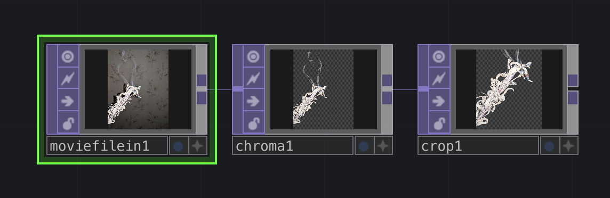
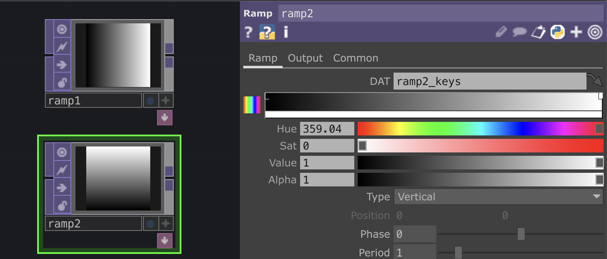
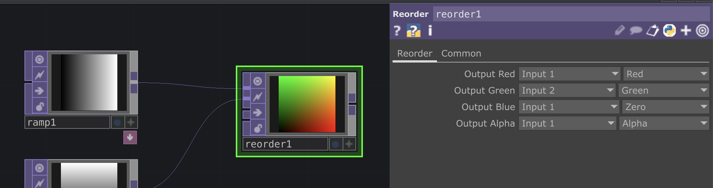
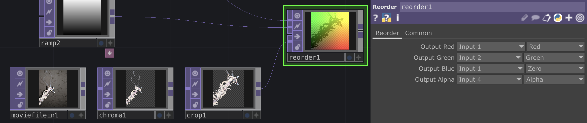
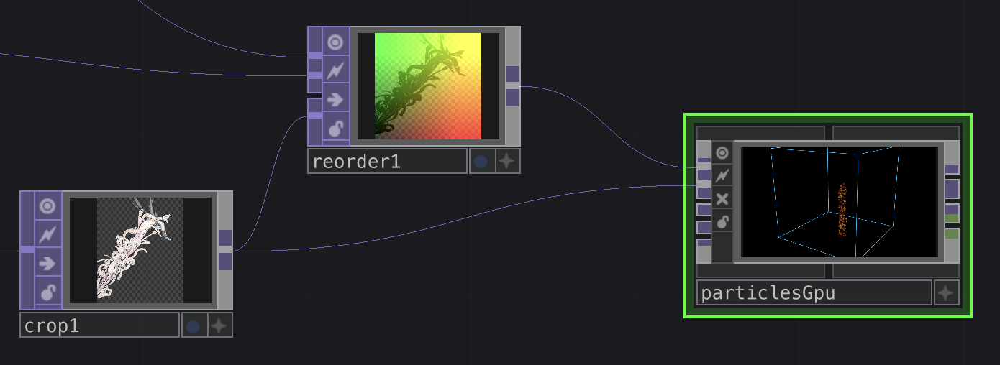
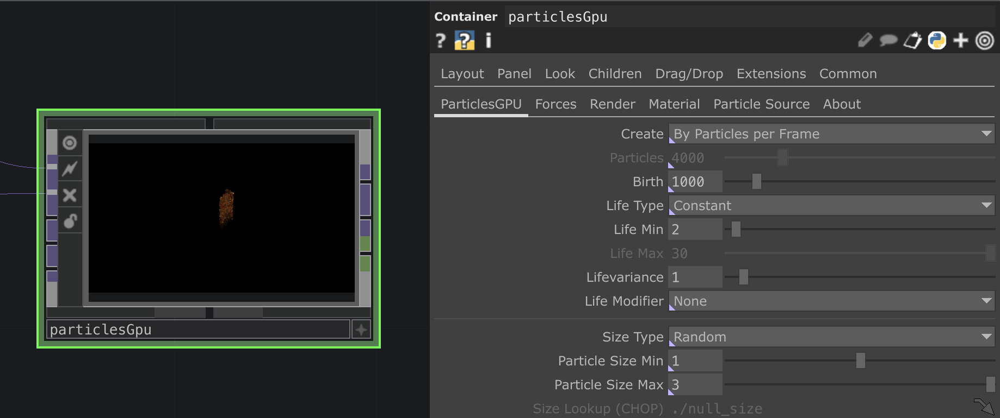
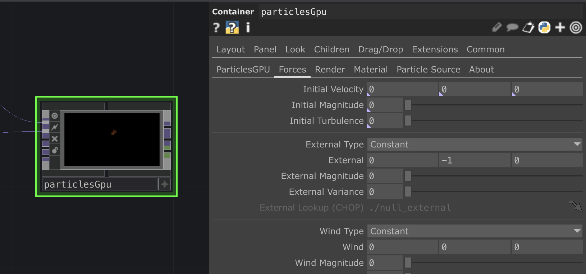
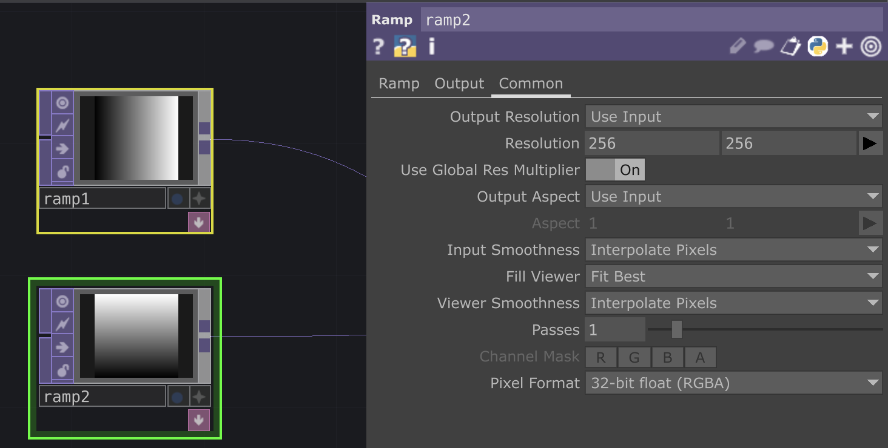
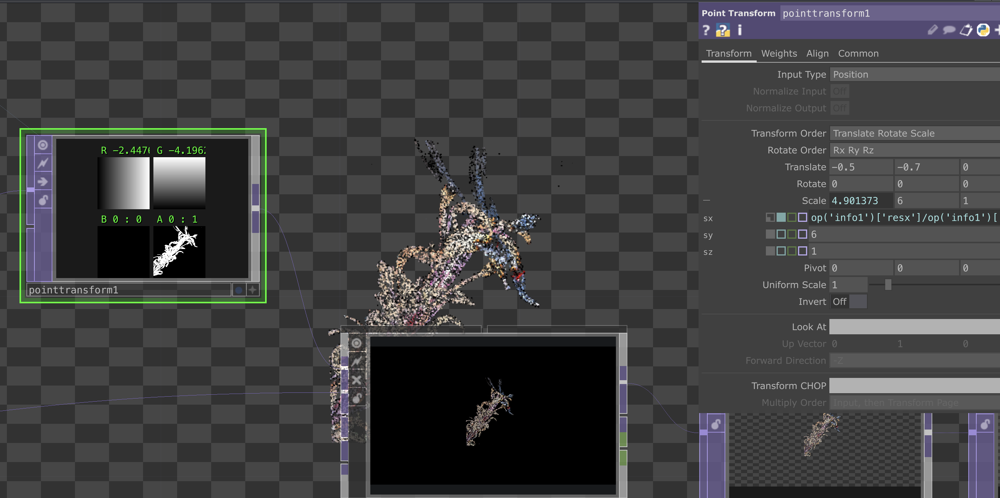

# Easy Particules dans TouchDesigner FR

Scroll down for english version.

*Ou comment créer un nuage de particules à partir d'une image.*

Basé sur ce tutoriel d'Anya Maryina: [.PNG into particles | Reorder TOP explained | TouchDesigner Tutorial
](https://www.youtube.com/watch?v=CcvhTgD7IOI&ab_channel=anyamaryina)

## Créer le setup

Importer une image sur fond transparent (ou dont on enlevera le fond) avec un `Movie File In` TOP. Enlever le fond si besoin avec un `Chroma Key` TOP et croper si besoin avec un `Crop`.

Créer également 2 `Ramp` TOP, un horizontal et un vertical.

Créer un `Reorder` TOP et mettre les 2 `Ramp` dans les 2 premières entrées.

Dans les paramètres du `Reorder`, sélectionner "Input 2" pour l'Output Green, et "Zero" pour l'Output Blue.

Ajouter l'image qu'on a importé dans la quatrième entrée du `Reorder` TOP et choisir "Input 4" pour l'Output Alpha. On doit alors voir apparaître la forme de notre image sur le `Reorder`.

## ParticlesGPU

Ouvrir la palette, et depuis le dossier "Tools" récuperer le node "ParticlesGpu".

Relier la sortie du `Reorder` à la première entrée du  "ParticlesGpu" et l'image importée à la seconde entrée.

La première entrée est la position des points pour les particules, et la seconde entrée est la couleur des particules.

Dans les paramètres de "ParticlesGpu", dans l'onglet "ParticlesGPU", mettre 1000 dans "Birth" (nombre total de particules), 2 et 1 dans "Life Min" et "Lifevariance" (durée de vie des particules et la variance) et décocher "Display Bounds".

On pourra toujours revenir plus tard modifier ces paramètres.

Dans l'onglet "Forces", mettre tous les paramètres qui finissent par " Magnitude" à 0.

Dans l'onglet "Material", choisir "Line" dans la liste Material.

## Adapter la taille

Pour l'instant on ne voit vaguement qu'une petite version de notre image au milieu du node "ParticlesGpu".

Pour pouvoir modifier la taille et la position dans le rendu, commencer par aller dans les paramètres des `Ramp` TOP, dans l'onglet "Common", et dans "Pixel Format" choisir "32-bit float RGBA".

Créer un `Point Transform` TOP entre le `Reorder` et le "particlesGpu" et modifier le paramètre "Uniform Scale" pour voir grandir les particules.

On peux aussi replacer le rendu au centre du node avec les paramètres "Translate".

# Easy Particules in TouchDesigner EN

*On how to create an image driven particules cloud.*

Based on this tutorial from Anya Maryina: [.PNG into particles | Reorder TOP explained | TouchDesigner Tutorial
](https://www.youtube.com/watch?v=CcvhTgD7IOI&ab_channel=anyamaryina)

## Setup

Import an image with a transparent background (or with a background you will erase) with a `Movie File In` TOP.
Erase the background if needed with a `Chroma Key` TOP and crop with a `Crop` TOP.

Create also 2 `Ramp` TOP, one horizontal and one vertical.

Create a `Reorder` TOP and connect the 2 `Ramp` in the first 2 inputs.

In the parameters of the `Reorder`, select "Input 2" for Output Green, and "Zero" for Output blue.

Add the imported image in the fourth input of the `Reorder` TOP and choose "Input 4" for Output Alpha.
We can now see the shape of the image in the `Reorder`.

## ParticlesGPU

Open the palette and get the "ParticlesGpu" node from the "Tools" file.

Connect the `Reorder` to the first input of the "ParticlesGpu" and the image to the second input.

The first input is points positions for the particles, and the second input is the particles colors.

In the "ParticlesGpu" parameters, in the "ParticlesGPU" tab, write 1000 in "Birth" (total number of particles), 2 and 1 in "Life Min" and "Lifevariance" (lifetime of the particles and the variance), and turn off "Display Bounds".

You can alway go back later to change these parameters.

In the "Forces" tab, put every parameters ending with "Magnitude" to 0.

In the "Material" tab, choose "Line" in the Material list.

## Resizing

For now, we only see a vague image in the middle of the "ParticlesGpu" node.

To be able to modify the size and position in the render, we start by going into the 2 `Ramp` TOPs parameters, in the "Common" tab, and choose "32-bit float RGBA" in "Pixel Format".

Create a `Point Transform` TOP between `Reorder` and "particlesGpu", and modifiy the parameter "Uniform Scale" to see the image made from particules growing bigger.

We can also move the render to the center of the node with the "Translate" parameters.

